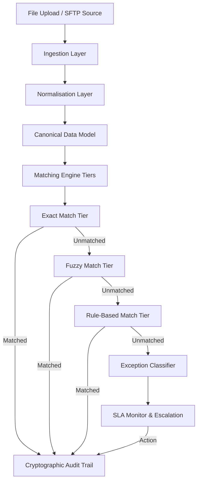

# Software Architecture & Design Document: Automated Reconciliation Engine

## 1. Executive Summary & Business Problem
In high-volume payment processing environments (e.g. payment aggregators, fintech aggregators, neo-banks), financial records are distributed across multiple internal transaction ledgers and external bank statements. Reconciling these records is critical to identify settlement timing differences, duplicate bookings, under-settlements, and fraudulent activities.

Manual reconciliation is slow, error-prone, and fails to scale. The **Automated Reconciliation Engine** provides a containerised, four-stage pipeline (Ingestion -> Normalisation -> Matching -> Exception & Auditing) to automate this workflow.

---

## 2. High-Level Design (HLD)
The system is designed around a sequential batch processing pipeline, exposing backend operations via a FastAPI REST gateway and presenting status overview charts and queues via an interactive Streamlit operations portal.

---

## 3. Low-Level Design (LLD)

### 3.1 Data Ingestion Layer
- **CSV Parser**: Uses Python's native `csv` streaming engine to avoid high memory overhead (>2GB) at scale. Maps custom headers dynamically from YAML configuration files.
- **SWIFT MT940 Parser**: Parses SWIFT tagged statement lines (e.g. `:61:` and `:86:`) using a state machine. Resolves format deviations like decimal comma separators, missing funds codes, and non-standard subfield mappings.
- **ISO 20022 CAMT.053 XML Parser**: Processes URN namespace-qualified XML schemas recursively utilizing `lxml.etree` XPath lookups.

### 3.2 Data Normalisation Layer
Transforms all source records into a standard `CanonicalTransaction` model:
- **Timezone alignment**: Normalises local time formats (e.g. `Asia/Kolkata`) to UTC using `pytz`.
- **Currency code validation**: Validates ISO 4217 inputs.
- **Banker's rounding**: standardises amounts to 4 decimal places utilizing banker's rounding (`ROUND_HALF_EVEN`) to eliminate mathematical bias in balance aggregates.
- **Reference & Counterparty cleaning**: Truncates spaces, strips special characters, expands abbreviations, and capitalises names.

### 3.3 Matching Engine
Executes three matching tiers sequentially:
1. **Exact Match**: Hash-based lookup using keys: `(txn_id + amount + currency + direction)` in $O(N+M)$ complexity. Collisions are disambiguated by narration similarity and date proximity.
2. **Fuzzy Match**: Candidate blocking limits comparison window to `±2` days and identical amount ranges to avoid $O(N \cdot M)$ cross-joins. String similarities are calculated using `RapidFuzz` Jaro-Winkler and Token Set Ratio.
3. **Rule-Based Match**: Evaluates date clearing offset calendar cycles, amount tolerances (cross-currency rate fluctuations under 1.5%), split transactions, and netted settlements utilizing a depth-bounded backtracking subset-sum algorithm.

#### Weighted Confidence Scoring formula:

$$\text{Score} = 0.35 \cdot S_{\text{ref}} + 0.25 \cdot S_{\text{amt}} + 0.15 \cdot S_{\text{date}} + 0.10 \cdot S_{\text{name}} + 0.10 \cdot S_{\text{dir}} + 0.05 \cdot S_{\text{ccy}}$$

- $\ge 0.85$: Automated match resolution.
- $0.60 \le \text{Score} < 0.85$: Human review suggestion queue.
- $< 0.60$: Flagged as unmatched exception.

### 3.4 Exception Classification & Escalation
All unmatched items are classified into **18 distinct categories** with defined SLAs and severities.
- *Direction Reversal SLA Correction*: Mismatched transaction directions (credit/debit indicators swapped) are classified as critical security or booking failures. The SLA is set to **30 minutes** with immediate escalation to Tier 4 Compliance.
- **4-Tier Escalation Model**: Escalates open exceptions across queues (Tier 1 Auto-Resolve -> Tier 2 Operations Analyst -> Tier 3 Senior Manager -> Tier 4 Compliance) upon SLA breaches or value thresholds exceeding ₹10 Lakh.

### 3.5 Cryptographic Audit Trail
Provides a block-chained log record. Every event computes a SHA-256 hash incorporating the previous entry's hash:

$$\text{Hash}_N = \text{SHA256}(\text{Hash}_{N-1} \mid \text{timestamp} \mid \text{actor} \mid \text{action\_type} \mid \text{records\_json} \mid \text{before\_state} \mid \text{after\_state} \mid \text{rationale})$$

The dashboard features a verification utility that traverses the database log sequence and re-computes all hashes to confirm audit log integrity.

---

## 4. Database Schema Design
We use PostgreSQL as the production database, structured as follows:

| Table | Purpose | Key Columns / Indexes |
|---|---|---|
| `users` | Operator authentication and roles | UUID PK, role index |
| `bank_configurations` | Dynamic parsing rules and windows | Bank Code PK |
| `reconciliation_runs` | Reconciliation job logs and match rates | Run ID PK, Date Index |
| `raw_transactions` | Ingested statement files partitioned by date | UUID PK, SHA-256 Unique index |
| `normalised_transactions` | Standardised ledger and statement records | UUID PK, Composite index `(txn_id, amount, currency, direction)` |
| `match_results` | Matches generated (Exact, Fuzzy, Rules) | PK, FK to internal/external txns |
| `exceptions` | Open and escalated anomalies | PK, Partial index on `status = 'OPEN'` |
| `audit_log` | Tamper-evident log blockchain | PK, Date BRIN Index, SHA-256 hash |
